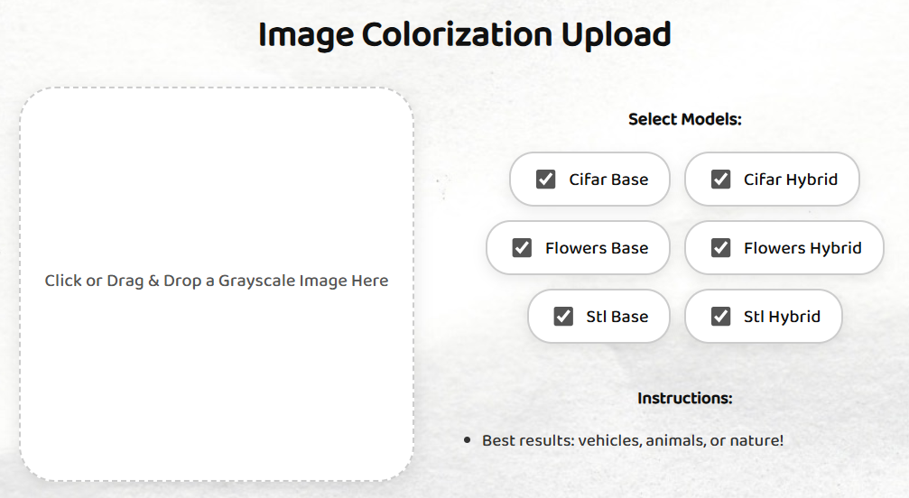
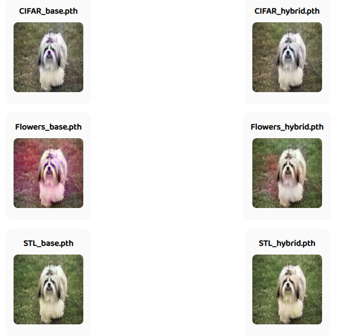

# Image Colorization - ML Project

TLDR: We built a CNN regressor model that converts grayscale images into color!

- For an intro to our project please check out our [presentation](Presentation_Slides.pdf)!

- For an in depth look, check out our [written report](Written_Report.pdf)!

- To see our model in action, look below for instructions to run our code!







## Project Structure

```
├── training/                      # Model training code
│   ├── model.py                   # Jupyter notebook with model architecture + training code. Saves model as .pth file
│
└── web_app/                       # Web application
    ├── backend/                   # Flask API
    │   ├── app.py                 # API endpoints for image upload + model inference
    │   ├── model.py               # Utility functions for loading model from downloaded .pth files + image processing
    │   └── requirements.txt       # Python dependencies for backend
    │
    └── frontend/                  # Web UI
        ├── project.html           # Landing page with project selection bubbles
        ├── image-upload.html      # Image recolorization upload page (grayscale → RGB)
        ├── model.html             # Page with notes on model design and architecture explanation
        ├── report.html            # Page for final research report
        ├── style.css              # Shared styling 
        ├── image-upload.css       # Styling specific to image-upload page (upload box behavior, layout)
        ├── upload.js              # Handles file preview + sending images to backend
        ├── script.js              # General UI interaction logic for project.html 
```

## Architecture

**Training** (`/training`):
- Develop and train the colorization model
- Save trained model as `.pth` file (to be used by backend)
- To run: Open model.ipynb, install dependencies, run cell by cell in Python 3.
    - Training cell: Uncomment lines to pick which model and dataset to train.
    - Testing cell: Uncomment lines to change how to model is tested (datasets, single image, multiple images in dir).

**Backend** (`/web_app/backend`):
- Flask API that loads model from `.pth` files on startup
- `/colourize` endpoint: accepts image → returns colorized image
- Model loaded once on startup, persists in memory
- To run:
  ```bash
  cd web_app/backend
  pip install -r requirements.txt
  python app.py
  ```

**Frontend** (`/web_app/frontend`):
- Web UI for uploading grayscale images
- Calls backend `/colourize` endpoint
- Displays colorized results
- To run: We run our app from our backend dir, so look above to see our app in action

## Key Design Notes

- **Single Git Repo**: Training code and web app are in the same repository
- **Model Storage**: Model is trained using google colab, saved as `.pth` file, and loaded by backend
- **No Retraining**: Backend loads model once on startup and keeps it in memory
- **Scalable**: Model persists across requests, no redundant loading
